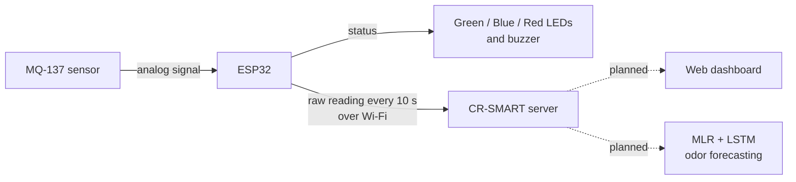

# CR-SMART IoT

**AI-Enabled IoT Odor Monitoring System with Predictive Data Analytics for the CEIT Male Restroom at CSUCC**

IoT-based restroom environmental and air quality monitoring system with AI predictive analytics.

> IT 114 — Advanced Human Computer Interaction · IoT System Project · 1st Semester, AY 2026–2027
> Caraga State University – Cabadbaran Campus (CSUCC)

---

## Group Members

| Name | GitHub |
|---|---|
| Johnny Guzon | [@guzonjohnny3](https://github.com/guzonjohnny3) |
| Riki Lloyd Fajardo | [@rikilloydfajardo-ai](https://github.com/rikilloydfajardo-ai) |
| Bernadine Cabilogan | [@cabiloganbernadine-lab](https://github.com/cabiloganbernadine-lab) |

## Project Rationale

_To be copied from the approved proposal._

## Hardware Components

| Qty | Component | Role in the system |
|---|---|---|
| 1 | ESP32 development board | Microcontroller — reads the sensor, processes data, controls the outputs |
| 1 | MQ-137 gas sensor module | Sensor — detects ammonia (NH₃), the main source of restroom odor |
| 3 | LEDs (red, blue, green) | Actuator — visual status indicators |
| 1 | Piezo buzzer (active) | Actuator — audible alert |
| 3 | 4.7 kΩ resistors | Current-limiting resistors for the LEDs |
| 1 | Resistor on the sensor line (10 kΩ according to the firmware notes) | Between the MQ-137 AO pin and ESP32 GPIO 34 |
| 1 | Breadboard | Prototype wiring |
| 13 | Jumper wires | Connections between the ESP32, sensor, and outputs |
| 1 | USB charging cable | Power and programming cable for the ESP32 |
| 1 | Power bank | Portable power supply |

## How the System Works



1. The **MQ-137** sensor detects ammonia (NH₃), the main source of urine odor.
2. The **ESP32** reads the sensor, compares it with the clean-air baseline, and decides the level: **NORMAL** (green LED), **MODERATE** (blue LED) or **HIGH** (red LED and beeping buzzer). Repeated HIGH readings within one minute raise an admin notice.
3. The ESP32 sends the raw reading to the **CR-SMART server** every 10 seconds when Wi-Fi is available.
4. The **web dashboard** shows the facility status, AI forecasts and cleaning dispatch. It currently uses example data; connecting it to the live readings is the next step. *(Dashed lines = planned.)*

Details: [`firmware/`](firmware/README.md) · [`dashboard/`](dashboard/README.md) · [`documentation/hardware/`](documentation/hardware/README.md)

## How to Run

| Part | Steps |
|---|---|
| Firmware | Open `firmware/cr_smart_mq137/cr_smart_mq137.ino` in the Arduino IDE, create `secrets.h` from `secrets.example.h`, upload to the ESP32, and open the Serial Monitor at 115200 baud. See [`firmware/README.md`](firmware/README.md). |
| Dashboard | Double-click `dashboard/login.html`. No installation or internet needed. |

## Repository Structure

```
CR-SMART_IoT/
├── README.md                    # Project overview (this file)
├── firmware/
│   ├── README.md                # Data flow, setup, Serial Monitor commands
│   └── cr_smart_mq137/
│       ├── cr_smart_mq137.ino   # ESP32 code: MQ-137 reading, LED/buzzer logic, upload
│       └── secrets.example.h    # Template for Wi-Fi and server settings (real secrets.h is not uploaded)
├── dashboard/                   # Web dashboard based on the approved Figma design (open dashboard/login.html)
└── documentation/
    ├── progress.md              # Progress log (date, task, status, member)
    ├── hardware/                # Prototype photos, pin connections, notes
    └── figma/                   # Approved Figma screens and their descriptions
```

## Current Status

| Area | Status |
|---|---|
| Hardware | Breadboard prototype assembled (ESP32, MQ-137, 3 LEDs, buzzer). [Photos and pin connections](documentation/hardware/README.md) |
| Firmware | Sensor reading, baseline calibration, NORMAL / MODERATE / HIGH levels, LED and buzzer control, admin notices, and data upload to the server. [Code and data flow](firmware/README.md) |
| Dashboard | 4 screens implemented from the Figma design (Login, Home, AI Monitoring, Cleaning Dispatch). Uses example data, not yet connected to live readings. [Dashboard](dashboard/README.md) |
| Figma design | 4 approved screens documented. [Figma screens](documentation/figma/README.md) |
| AI predictive analytics | Planned (MLR and LSTM). Models not yet trained. |

## Midterm Progress Checklist

Based on the IT 114 midterm rubric.

| Rubric criterion | Evidence in this repository | Status |
|---|---|---|
| Hardware setup & functionality | Prototype photos, pin connection table, LED/buzzer behavior | Prototype wired; test results to be added |
| Code / data flow | ESP32 sketch, data flow diagram, Serial Monitor commands | Code in repository |
| UI / dashboard | 4 Figma screens implemented and navigable, side-by-side with the Figma design | Done (example data) |
| Alignment with proposal | System title, hardware components, documented design differences | Rationale still to be added |
| GitHub documentation | README files in every folder, progress log, commits from all members | Ongoing |

See [`documentation/progress.md`](documentation/progress.md) for the detailed progress log.
