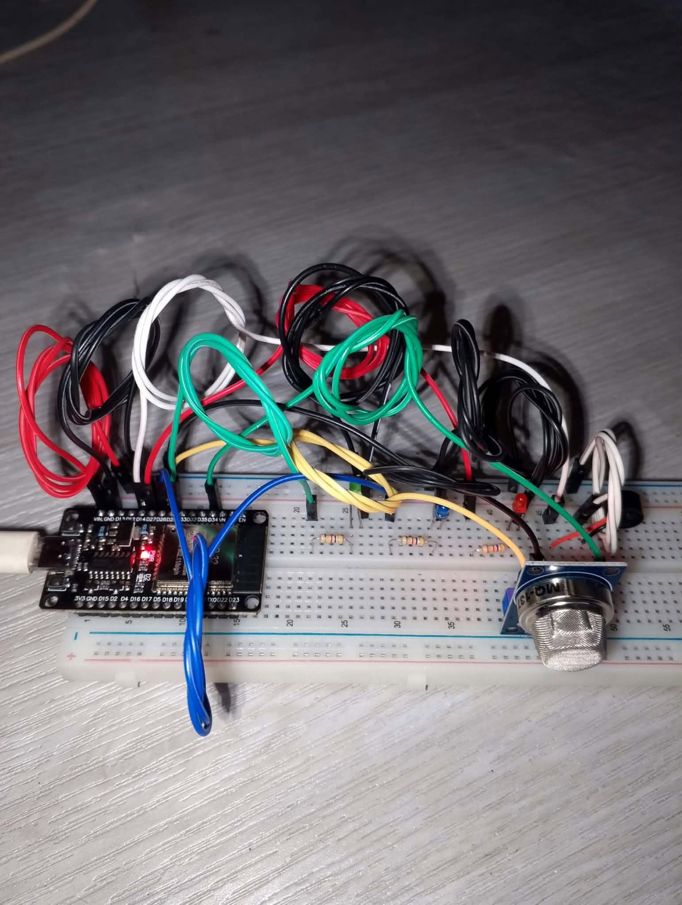
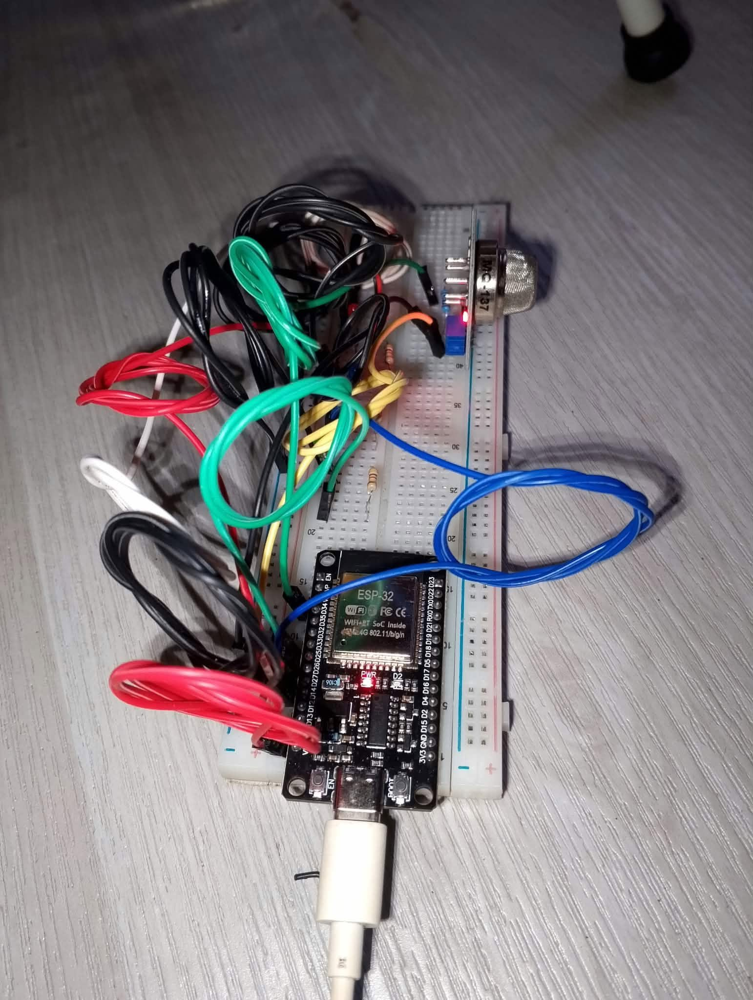
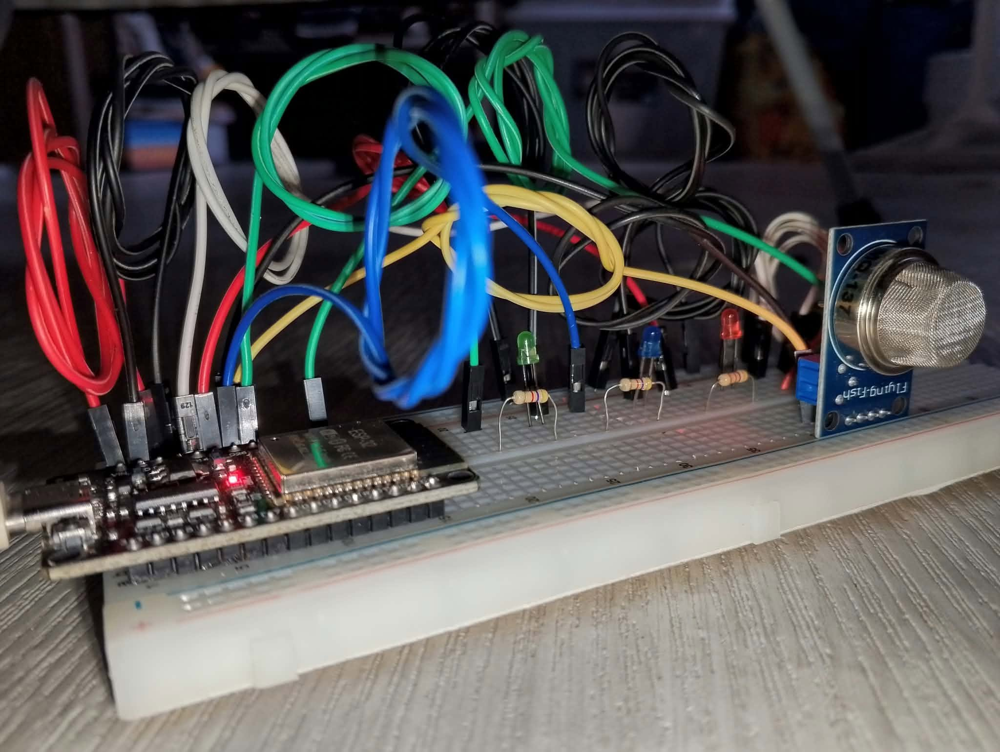

# Hardware Documentation

## Breadboard Prototype Photos

Actual photos of the assembled breadboard prototype.

| Top view | ESP32 view | Side view |
|---|---|---|
|  |  |  |

**What the photos show:**

- ESP32 development board (USB-C), powered through a USB cable
- MQ-137 gas sensor module mounted on the breadboard
- 3 status LEDs (green, blue, red), each with a 4.7 kΩ resistor
- Active piezo buzzer
- Jumper wires connecting the components to the ESP32

## Pin Connections

_To be added (ESP32 pin ↔ component table)._

## Wiring Diagram

_To be added._
