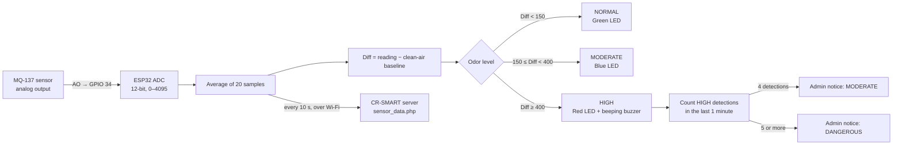

# Firmware (ESP32)

ESP32 code for CR-SMART. It reads the **MQ-137 ammonia (NH₃) sensor**, decides the odor level, and shows it on the **LEDs and buzzer**.

**Written by:** Bernadine Cabilogan
**Sketch:** [`cr_smart_mq137/cr_smart_mq137.ino`](cr_smart_mq137/cr_smart_mq137.ino)

## Data flow



1. **Read.** The sensor's analog output goes to GPIO 34. The ESP32 reads it as a number from 0 to 4095 and averages 20 samples to smooth out noise.
2. **Warm up and calibrate.** At start-up the sensor warms up for 60 seconds (the green LED blinks), then the ESP32 measures the clean-air **baseline** for 5 seconds.
3. **Process.** Every 0.25 seconds it computes `Diff = reading − baseline` and picks the odor level:

   | Level | Condition (ADC units above baseline) | LED | Buzzer |
   |---|---|---|---|
   | NORMAL | Diff < 150 | Green | Off |
   | MODERATE | 150 ≤ Diff < 400 | Blue | Off |
   | HIGH | Diff ≥ 400 | Red | Beeping |

4. **Count detections.** Each HIGH (red + buzzer) event is counted. If it stays HIGH, it counts again every 10 seconds. Within the last minute, **4 detections** trigger a *MODERATE* admin notice and **5 or more** trigger a *DANGEROUS* notice. For now, notices are printed in the Serial Monitor.
5. **Send.** Every 10 seconds, when Wi-Fi is connected, the raw reading is sent as JSON (`device_id`, `mq137_raw`) to the CR-SMART server endpoint `sensor_data.php`. Manual/demo values are never sent.

The thresholds (150 and 400) are starting values and still need tuning with real odor samples.

## Setup

1. Install the **ESP32 board package** in the Arduino IDE (Boards Manager → *esp32 by Espressif Systems*).
2. Open `cr_smart_mq137/cr_smart_mq137.ino`.
3. Make a copy of `secrets.example.h` in the same folder, name it **`secrets.h`**, and put in the real Wi-Fi name, password, server URL and device key.
   `secrets.h` is in `.gitignore`, so it is never uploaded to GitHub.
4. Select the ESP32 board and port, then click **Upload**.
5. Open the **Serial Monitor** at **115200 baud**.

To run without Wi-Fi or a server, set `ENABLE_CLOUD = false` at the top of the sketch. The LEDs, buzzer and Serial Monitor still work.

## Serial Monitor commands

Type a character and press Enter.

| Key | Action |
|---|---|
| `c` | Re-measure the clean-air baseline |
| `t` | Print a TEST admin notification |
| `1` | Manual: force NORMAL (green) |
| `2` | Manual: force MODERATE (blue) |
| `3` | Manual: force HIGH (red + buzzer) |
| `r` | Manual: one 2-second HIGH detection (type 4–5 times, about 3 seconds apart, to show the admin notices) |
| `0` | Manual off, back to the real sensor |

Manual values are marked `[MANUAL]` in the Serial Monitor so they are never mistaken for real readings.

## Serial Monitor output format

Each loop prints one line like this (the numbers here only illustrate the format; they are not a recorded reading):

```
ADC: 1234 | Baseline: 1100 | Diff:  +134 | NORMAL   | Red in 1 min: 0 | Admin: -
```

## Pin connections

See [`documentation/hardware/README.md`](../documentation/hardware/README.md#pin-connections).

| Component | ESP32 pin |
|---|---|
| MQ-137 AO | GPIO 34 |
| Green LED | GPIO 25 |
| Blue LED | GPIO 26 |
| Red LED | GPIO 27 |
| Buzzer (+) | GPIO 14 |
